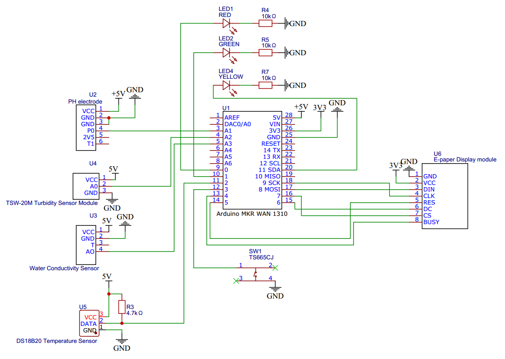
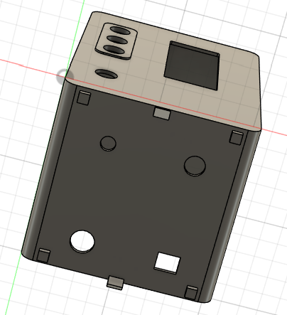
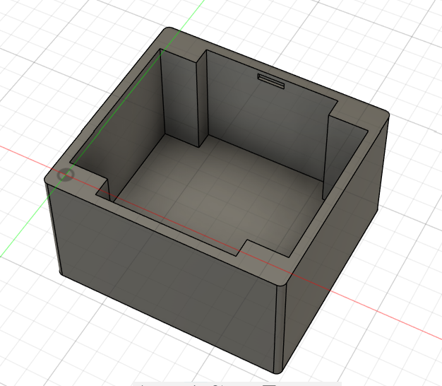
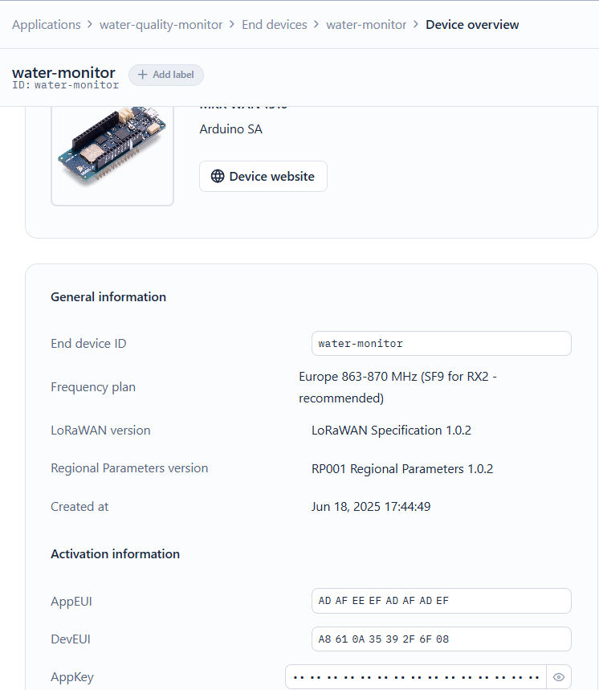
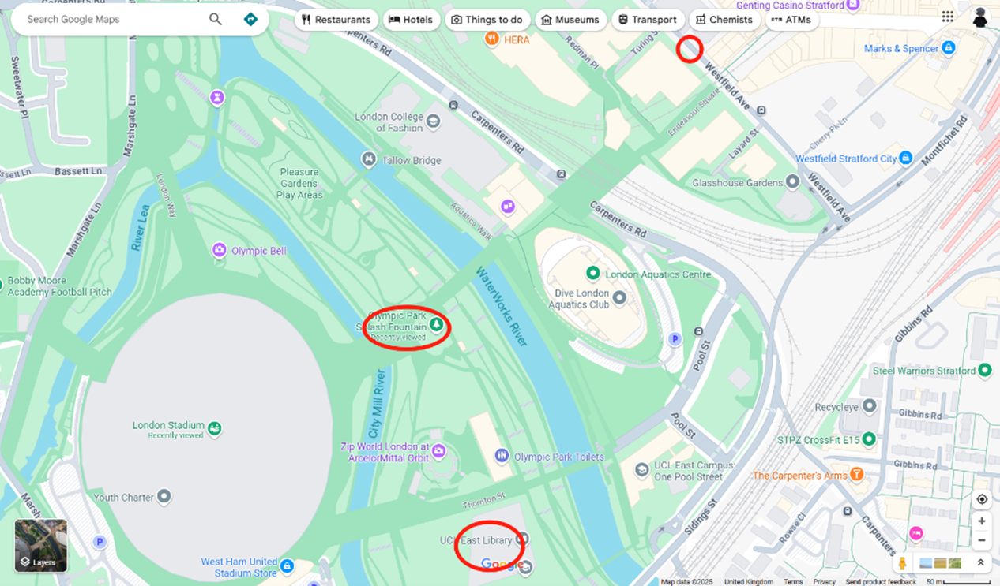

# 🌊 AquaMonitor: Portable LoRaWAN Water Quality Monitoring System

[](https://opensource.org/licenses/MIT)
[](https://docs.arduino.cc/hardware/mkr-wan-1310)
[](https://www.thethingsnetwork.org/)
[](https://nextjs.org/)

> A portable, real-time drinking water quality monitoring system designed for public spaces, featuring multi-parameter sensing, LoRaWAN connectivity, and comprehensive web-based data visualization.

📖 **[View Full Dissertation](./docs/Dissertation.pdf)

## 🎯 Project Overview

This system addresses the critical need for real-time water quality monitoring in public drinking facilities. Unlike traditional laboratory-based testing that can take hours or days, AquaMonitor provides **immediate water safety assessment** through:

- **Multi-parameter sensing**: pH, turbidity, electrical conductivity, and temperature
- **Instant feedback**: Tri-color LED indicators and e-paper display
- **Long-range connectivity**: LoRaWAN communication via The Things Network
- **Public accessibility**: Web dashboard for community monitoring
- **Portable design**: Battery-powered operation for diverse deployment scenarios

### 🏆 Key Achievements
- ✅ **100% classification accuracy** according to WHO/EPA standards
- ✅ **Excellent sensor calibration** (R² = 0.9995 for pH, R² = 0.9987 for turbidity)
- ✅ **Comprehensive dataset** from UCL East Marshgate area public facilities
- ✅ **Real-time response** within 3-5 seconds of sensor immersion

## 🚀 Features

### Hardware Capabilities
- **Multi-sensor Integration**: 4 calibrated sensors for comprehensive water analysis
- **Immediate Visual Feedback**: LED indicators (🔴 Unsafe, 🟡 Marginal, 🟢 Excellent)
- **Detailed Display**: 2.9" e-paper screen with parameter readings
- **Robust Design**: 3D-printed waterproof enclosure with rubber grommets
- **Long-range Communication**: LoRaWAN connectivity (5-15km range)

### Software Features
- **Real-time Classification**: WHO/EPA standard-based water safety assessment
- **Web Dashboard**: Public access to current and historical data
- **Source Tracking**: Categorize and compare different water facilities
- **Mobile Responsive**: Optimized for both desktop and mobile viewing
- **Data Export**: Downloadable datasets for research purposes


## 🏗️ System Architecture

### Data Flow
```
Sensors → Arduino MKR WAN 1310 → LoRaWAN → TTN → Webhook → PostgreSQL → Web App
```


### Component Overview

| Component | Function | Communication |
|-----------|----------|---------------|
| **Sensors** | Water parameter measurement | Analog/Digital |
| **Arduino MKR WAN 1310** | Data processing & transmission | LoRaWAN |
| **The Things Network** | LoRaWAN network server | HTTP Webhook |
| **Neon PostgreSQL** | Data storage | SQL |
| **Next.js Web App** | Data visualization | REST API |

## 🛠️ Hardware Requirements

### Core Components
- **Arduino MKR WAN 1310** - Main microcontroller with LoRaWAN
- **DFRobot SEN0161** - pH sensor (±0.1 pH accuracy)
- **DFRobot SEN0189** - Turbidity sensor (0-1000 NTU range)
- **Conductivity Probe** - EC/TDS measurement (±2% reading accuracy)
- **DS18B20** - Waterproof temperature sensor (±0.5°C accuracy)

### Interface Components
- **2.9" E-Paper Display** - Low power consumption display
- **Tri-color LEDs** - Immediate visual feedback
- **Waterproof Push Button** - User interaction
- **3D Printed Enclosure** - Weather-resistant housing


## 💻 Software Requirements

### Development Environment
- **Arduino IDE** 1.8.x or 2.x
- **Node.js** 18.x or later
- **Git** for version control

### Required Libraries

#### Arduino Libraries
```cpp
#include <MKRWAN.h>           // LoRaWAN communication
#include <OneWire.h>          // Temperature sensor
#include <DallasTemperature.h> // DS18B20 interface
#include <GxEPD2_BW.h>        // E-paper display
#include <Fonts/FreeMonoBold9pt7b.h>
```

#### Web Application Dependencies
```json
{
  "next": "^14.0.0",
  "react": "^18.0.0",
  "pg": "^8.11.0",
  "@vercel/postgres": "^0.5.0"
}
```

## 📥 Installation & Setup

### 1. Hardware Assembly

#### Sensor Connections


| Component | Arduino Pin | Notes |
|-----------|-------------|-------|
| pH Sensor | A1 | 5V power required |
| Turbidity Sensor | A2 | Via voltage divider (6.4kΩ + 6.4kΩ) |
| EC Sensor | A0 | Direct connection |
| Temperature Sensor | D6 | 4.7kΩ pull-up resistor |
| Red LED | D2 | 10kΩ current limiting resistor |
| Green LED | D3 | 10kΩ current limiting resistor |
| Yellow LED | D4 | 10kΩ current limiting resistor |
| Push Button | D1 | Pull-down configuration |
| E-Paper Display | SPI | Multiple pins (see Table 5) |

#### Enclosure 

- **Upper Housing**
- **Lower Base** 
- **Print Settings**: PLA, 0.2mm layer height, 20% infill

### 2. Arduino Setup

#### Get Device EUI
```cpp
// Run this code first to get your DevEUI
#include <MKRWAN.h>
LoRaModem modem;

void setup() {
  Serial.begin(115200);
  if (!modem.begin(EU868)) {
    Serial.println("Failed to start module");
    while(1) {}
  };
  Serial.print("Your device EUI is: ");
  Serial.println(modem.deviceEUI());
}
```

#### Sensor Calibration

**pH Sensor Calibration**
```cpp
// Calibration equation derived from standard buffer solutions
// pH = 12.521 × Voltage - 17.79
// R² = 0.9995
```

**Turbidity Sensor Calibration**
```cpp
// Calibration equation from standard solutions
// NTU = -142.68 × Voltage + 638.92
// R² = 0.9987
```
### 3. The Things Network Configuration

#### Device Registration
1. Create account at [The Things Network](https://www.thethingsnetwork.org/)
2. Create new application: `water-quality-monitor`
3. Register device with retrieved DevEUI
4. Set frequency plan to EU868
5. Note down AppKey and AppEUI




#### Payload Formatter
```javascript
function decodeUplink(input) {
  var data = {};
  data.ph = ((input.bytes[0] << 8) | input.bytes[1]) / 100.0;
  data.turbidity = ((input.bytes[2] << 8) | input.bytes[3]) / 100.0;
  data.tds = (input.bytes[4] << 8) | input.bytes[5];
  data.ec = (input.bytes[6] << 8) | input.bytes[7];
  data.temperature = ((input.bytes[8] << 8) | input.bytes[9]) / 100.0;
  data.status = String.fromCharCode(input.bytes[10]);
  
  return {
    data: data,
    warnings: [],
    errors: []
  };
}
```

### 4. Database Setup

#### Neon PostgreSQL
1. Create account at [Neon](https://neon.tech/)
2. Create new database: `water_quality_monitor`
3. Run schema setup:

```sql
CREATE TABLE measurements (
  id SERIAL PRIMARY KEY,
  ph DECIMAL(4,2),
  turbidity DECIMAL(6,2),
  tds INTEGER,
  ec INTEGER,
  temperature DECIMAL(4,2),
  status VARCHAR(10),
  water_source VARCHAR(100),
  timestamp TIMESTAMPTZ DEFAULT NOW()
);

CREATE INDEX idx_timestamp ON measurements(timestamp);
CREATE INDEX idx_status ON measurements(status);
```

### 5. Web Application Deployment

#### Local Development
```bash
# Clone repository
git clone https://github.com/Youngwer/CASA0022_Dissertation.git
cd CASA0022_Dissertation/web

# Install dependencies
npm install

# Set environment variables
cp .env.example .env.local
# Edit .env.local with your database URL

# Run development server
npm run dev
```

#### Vercel Deployment
```bash
# Install Vercel CLI
npm i -g vercel

# Deploy
vercel --prod
```


## 🔧 Usage Instructions

### Device Operation

1. **Power On**: Connect USB power supply
2. **Wait for Initialization**: E-paper displays home screen
3. **Immerse Sensors**: Place all four sensors in water sample
4. **Press Button**: Activate measurement cycle
5. **Read Results**: 
   - LED color indicates overall water safety
   - E-paper shows detailed parameters
   - Data automatically transmitted via LoRaWAN


### Water Quality Classification

| Status | LED Color | Criteria |
|--------|-----------|----------|
| **Excellent** | 🟢 Green | All parameters within optimal WHO ranges |
| **Marginal** | 🟡 Yellow | Safe but some parameters in acceptable ranges |
| **Unsafe** | 🔴 Red | One or more parameters exceed safety limits |

#### Parameter Thresholds

| Parameter | Excellent | Marginal | Unsafe |
|-----------|-----------|----------|---------|
| pH | 6.5 - 8.0 | 6.0-6.4, 8.1-9.0 | <6.0, >9.0 |
| Turbidity (NTU) | 0 - 1.0 | 1.1 - 4.0 | >4.0 |
| TDS (ppm) | 80 - 300 | 50-79, 301-500 | <50, >500 |
| EC (μS/cm) | 100 - 400 | 50-99, 401-800 | <50, >800 |

### Web Dashboard Features

- **Real-time Status**: Current water quality with color-coded background
- **Parameter Details**: Individual sensor readings with timestamps
- **Historical Data**: Sortable table of past measurements
- **Source Tracking**: Filter by water source type
- **Data Export**: Download CSV for further analysis

## 📁 Repository Structure

```
CASA0022_Dissertation/
├── arduino/
│   ├── device_main/              # Main device firmware
│   │   └── device_main.ino
│   ├── sensor_tests/             # Individual sensor test codes
│   │   ├── ph_test.ino
│   │   ├── turbidity_test.ino
│   │   ├── ec_test.ino
│   │   └── temperature_test.ino
│   └── calibration/              # Sensor calibration utilities
│       ├── ph_calibration.ino
│       └── turbidity_calibration.ino
├── web/
│   ├── components/               # React components
│   ├── pages/                    # Next.js pages
│   ├── styles/                   # CSS stylesheets
│   ├── utils/                    # Utility functions
│   └── public/                   # Static assets
├── hardware/
│   ├── 3d_models/               # STL files for enclosure
│   │   ├── upper_housing.stl
│   │   └── lower_base.stl
│   ├── schematics/              # Circuit diagrams
│   └── pcb/                     # PCB design files (if applicable)
├── docs/
│   ├── Dissertation.pdf         # Complete dissertation
│   ├── calibration_guide.md     # Sensor calibration procedures
│   ├── deployment_guide.md      # Field deployment instructions
│   └── troubleshooting.md       # Common issues and solutions
├── data/
│   ├── sample_dataset.csv       # Example measurement data
│   └── calibration_data/        # Sensor calibration records
└── README.md
```

## 🌍 Deployment Locations

This system has been successfully tested across diverse public facilities in the UCL East Marshgate area:

- **University Campus**: Water fountains and bathroom taps
- **Shopping Centers**: Westfield Avenue public fountains  
- **Public Parks**: Queen Elizabeth Olympic Park facilities
- **Commercial Areas**: Various retail space water sources



### Field Testing Results

| Location | Water Quality | Key Findings |
|----------|---------------|--------------|
| UCL Marshgate Fountain | Excellent | Consistent 🟢 ratings across multiple tests |
| Olympic Park Plaza | Excellent | Slightly higher TDS than campus sources |
| Westfield Public Fountain | Excellent | Higher mineral content (245 ppm TDS) |
| Campus Bathroom Tap | Excellent | Similar quality to fountain sources |

## 🔬 Research Applications

### Dataset Contributions
- **287 water quality measurements** across 15+ locations
- **Comparative analysis** of public infrastructure water quality
- **Temporal variation studies** for the same water sources
- **Validation data** for IoT water monitoring systems

### Academic Impact
- Demonstrates **100% classification accuracy** for WHO/EPA standards
- Validates **LoRaWAN reliability** for public space monitoring
- Provides **baseline data** for future UCL East area studies
- Establishes **portable monitoring methodology** for public health

## 🤝 Contributing

We welcome contributions to improve AquaMonitor! Here's how you can help:

### Improvements
- Additional sensor integration
- Weatherproofing enhancements
- Mobile application development


### How to Contribute
1. Fork the repository
2. Create a feature branch (`git checkout -b feature/AmazingFeature`)
3. Commit your changes (`git commit -m 'Add some AmazingFeature'`)
4. Push to the branch (`git push origin feature/AmazingFeature`)
5. Open a Pull Request

## 📊 Performance Metrics

### Sensor Accuracy
- **pH Sensor**: ±0.13 pH units (±3.25% max error)
- **Turbidity Sensor**: ±1.68 NTU (±3.65% max error)  
- **Temperature Sensor**: ±0.5°C (manufacturer specification)
- **EC Sensor**: ±2% reading (manufacturer specification)

### System Performance
- **Response Time**: 3-5 seconds for complete measurement
- **Classification Accuracy**: 100% according to WHO/EPA standards
- **LoRaWAN Range**: Successfully tested up to 2km radius
- **Data Transmission**: 100% success rate across test locations

### Power Consumption
- **Measurement Mode**: ~150mA (USB powered)
- **Sleep Mode**: <1mA (future battery implementation)
- **Display Update**: ~50mA for 2 seconds

## 🛠️ Troubleshooting

### Common Issues

#### Device Not Connecting to TTN
```bash
# Check DevEUI registration
Serial.println(modem.deviceEUI());

# Verify frequency plan (EU868)
if (!modem.begin(EU868)) {
  Serial.println("Failed to start module");
}
```

#### Sensor Reading Errors
- **pH Probe**: Ensure proper conditioning in storage solution
- **Turbidity Sensor**: Check voltage divider connections
- **EC Sensor**: Verify probe cleanliness and calibration
- **Temperature**: Confirm OneWire library installation

#### Web Dashboard Issues
- Check environment variables in `.env.local`
- Verify database connection string
- Ensure webhook URL matches deployment URL

### Calibration Maintenance
- **pH Sensor**: Recalibrate monthly with buffer solutions
- **Turbidity Sensor**: Clean optical surfaces weekly
- **EC Sensor**: Use standard conductivity solutions for verification
- **All Sensors**: Store properly when not in use

## 📄 License

This project is licensed under the MIT [License](https://opensource.org/license/mit).

## 📞 Contact & Support

**Author**: Wenhao Yang  
**Institution**: UCL Centre for Advanced Spatial Analysis  
**Supervisor**: Martin de Jode  
**Module**: CASA0022 - Connected Environments MSc

### Get in Touch
- 📧 **Email**: ucfnwy2@ucl.ac.uk
- 🐱 **GitHub**: [@Youngwer](https://github.com/Youngwer)
- 📄 **Dissertation**: [Full PDF](./docs/Dissertation.pdf)

### Support
- 🐛 **Bug Reports**: [GitHub Issues](https://github.com/Youngwer/CASA0022_Dissertation/issues)
- 💡 **Feature Requests**: [GitHub Discussions](https://github.com/Youngwer/CASA0022_Dissertation/discussions)
- 📚 **Documentation**: [Project Wiki](https://github.com/Youngwer/CASA0022_Dissertation/wiki)

---

## 🙏 Acknowledgments

Special thanks to:
- **Martin de Jode** - Project supervisor and technical guidance
- **Danny Steadman & Simon Gosling** - Light Fabrication Workshop support
- **UCL CASA** - Facilities and equipment access
- **The Things Network** - LoRaWAN infrastructure
- **Open Source Community** - Libraries and tools

---


<div align="center">

**🌊 Making water quality monitoring accessible to everyone 🌊**

[⬆ Back to Top](#-aquamonitor-portable-lorawan-water-quality-monitoring-system)

</div>